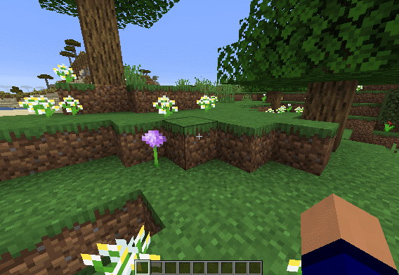
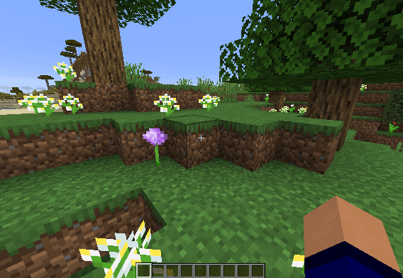

# SneakAnimation
### Minecraft Forge mod that lets you tweak the first person smooth sneaking animation

Adds a modifier to the camera smoothing when sneaking. 
The modifier can be changed in the in-game config. 
There is also an option to disable the smoothing entirely. 

This mod does not change anything about sneaking other than the camera animation.

This mod is client-side, so it does not need to be installed on the server for it to work.

### [Releases](https://github.com/PieKing1215/SneakAnimation/releases)

Requires [Cloth Config](https://www.curseforge.com/minecraft/mc-mods/cloth-config-forge) so the config screen works.

## Speeds & Demo
The config lets you set the speed anywhere from 10% to 250% 
100% is vanilla, and anything above 200% makes the animation "bounce" a bit. 
### 50% Speed: 
 
### 100% Speed (Vanilla): 
 
### 150% Speed: 
 

## Usage

Feel free to use in packs if you wish (though compatibility hasn't been tested thoroughly)

Do not download this mod from anywhere other than the SneakAnimation GitHub page or the SneakAnimation Curseforge page. 
This mod may not be reposted to any other third-party websites. 
[#StopModReposts](https://stopmodreposts.org)

Tested on Forge 31.2.31 with MC 1.15.2, on both singleplayer and multiplayer.

Other mods shouldn't conflict unless they also change the sneak animation.

The mod is licensed under the [GNU General Public License v3.0](LICENSE.md)
